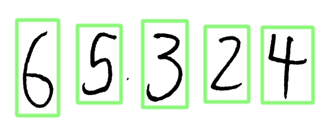

# Deep Learning Capstone Project
## Background
### Recognizing Text
While computers can easily digest and process text input like the sentence you're reading right now, the task of recognizing text that is depicted by an image has [historically](https://en.wikipedia.org/wiki/Timeline_of_optical_character_recognition) been much more difficult.  

Early attempts relied on [heavily](https://en.wikipedia.org/wiki/OCR-A)-[standardized](https://en.wikipedia.org/wiki/OCR-B) fonts, responsible in large part for the iconic blocky numbers at the bottom of checks (7 below).  

Digit recognition can be thought of as a **subset of text recognition** (a 10-character subset, to be exact).

### A Benchmark for Comparison
Recent attempts at digit recognition generally orbit known datasets of digits such as the Modified National Institute of Standards and Technology, or [MNIST](http://yann.lecun.com/exdb/mnist/index.html) for short.  This allows for much easier comparison of methodology and results than if every attempt were made on a custom, bespoke dataset.

The MNIST dataset is known as a relatively "clean" dataset; there's not much noise or skew, and each element in the dataset represents a single digit.  
But such a well-ordered dataset isn't typically what we ask **digit recognizers** to analyze; instead, if we're lucky we have good-quality scans of documents containing lots of non-digit information along with digits.  
If we're really unlucky (or _adventurous_) we might even ask our **digit recognizer** to find the digits in a photograph of a physical location.  This would introduce subsidiary problems of lighting, perspective, and contrast which often aren't present in scanned documents.  

A dataset which popularly represents this type of "in the wild" digits is Stanford's Street View House Numbers, or [SVHN](http://ufldl.stanford.edu/housenumbers/), dataset.  Obtained from Google's [Street View](https://www.google.com/streetview/), digits in this dataset are more difficult to correctly recognize than are digits from the MNIST dataset.

### Fueled by Competition
People have taken many different approaches to the MNIST and SVHN datasets, from [adaptive thresholding](https://www.researchgate.net/profile/Chirag_Patel27/publication/235956427_Optical_Character_Recognition_by_Open_source_OCR_Tool_Tesseract_A_Case_Study/links/00463516fa43a64739000000.pdf) to [linear classifiers](http://yann.lecun.com/exdb/publis/index.html#lecun-98) to [k-nearest neighbors](http://ieeexplore.ieee.org/document/4250467/) to [boosted stumps](http://hal.in2p3.fr/in2p3-00614564/document).

Currently, the digit-recognition algorithm with the highest accuracy involves **[neural networks](http://ufldl.stanford.edu/housenumbers/nips2011_housenumbers.pdf)**.

### Neural Networks
[Neural networks](https://en.wikipedia.org/wiki/Artificial_neural_network) are effective [function approximators](http://neuralnetworksanddeeplearning.com/chap4.html), but it turns out that the deeper the neural net is, the [more complicated](https://en.wikipedia.org/wiki/Deep_learning#Applications) are the tasks it can perform.

Interestingly, it's [not immediately obvious](https://www.youtube.com/watch?v=BFdMrDOx_CM) why neural nets should perform so well on **digit recognition**, and yet they do, both [on MNIST](https://www.kaggle.com/c/digit-recognizer/leaderboard) and [on SVHN](http://static.googleusercontent.com/media/research.google.com/en//pubs/archive/42241.pdf).

This suggests that the practice of digit recognition has, for the moment at least, surpassed the theory for why they should work so well.  
This is a fascinating place to be, as it suggests that further contributions to **digit recognition** are unlikely without a [better understanding](http://yosinski.com/deepvis) of how neural nets function.

## Problem Statement
This project seeks to identify and output numbers which are contained in images.

## Dataset and Inputs
### About the Dataset
The [SVHN](http://ufldl.stanford.edu/housenumbers/) dataset will be used to develop the neural network model because of its closer resemblance to real-world digit data than digits from the [MNIST](http://yann.lecun.com/exdb/mnist/index.html) dataset.

The entire [SVHN](http://ufldl.stanford.edu/housenumbers/) dataset contains 4GB of data, or approximately 600,000 digit images.  These digit-images are provided either as standalone 32x32 single-character images, or as larger images containing sequences of individual digits in varying alignments and with varying spacing.  
This project will use the larger images exclusively, as this represents a more realistic challenge than does using the standalone single-character images.

Also provided in `Matlab` format are "bounding boxes" which denote the location and label of individual digits within the image, for use in training the model.

### Model Development
Training the convolutional network [EBLearn](http://eblearn.sourceforge.net/svhn_tutorial.html) on 10,000 training samples and 6,000 validation samples from the [SVHN](http://ufldl.stanford.edu/housenumbers/) dataset generally takes ~10 minutes.  
Runtimes for the model being developed for this project are expected to be roughly the same order of magnitude.  
Therefore, subsetting the dataset is a pragmatic concession to speed model development.

Once a neural net model has been determined, a larger subset of the [SVHN](http://ufldl.stanford.edu/housenumbers/) dataset will be used to train the model.  
  

### Testing on New Data
Once the model has been developed and trained, the model will be fed images from the wild to see how it performs.  

Hopefully, images from the wild will not require explicit digit-boxing during preprocessing, although they will probably need to be cropped to exclude the parts of the image which do not contain digits.  
If digit-boxing is required, a potential solution would be to [employ](http://stackoverflow.com/a/9620295/6052663) [contour finding](http://docs.opencv.org/3.1.0/dd/d49/tutorial_py_contour_features.html) from the OpenCV Python library.

A potential source of images from the wild is Google Street View itself.  Unfortunately, there is no way of knowing whether a particular Street View capture was already included in the training set, which would misleadingly enable a correct reading of the test image.

A better source of images from the wild is to photograph digits (e.g. street address, apartment numbers, segments of phone numbers).  As this would be a manual exercise, the size of this dataset would necessarily be limited.

## Solution Statement
This will be accomplished through the creation and training of a deep neural net to recognize numeric content within an image.

Python 2.7 and publicly-available libraries will be used to accomplish this task.  
These are expected to include `numpy`, `jupyter`, `TensorFlow`, and `opencv`.

## Benchmark Model
[Goodfellow et al.](http://static.googleusercontent.com/media/research.google.com/en//pubs/archive/42241.pdf) achieved 91% whole-sequence recognition accuracy on the private [SVHN](http://ufldl.stanford.edu/housenumbers/) dataset, and 96% whole-sequence recognition accuracy on the public [SVHN](http://ufldl.stanford.edu/housenumbers/) dataset.  
This project attempts to recreate their performance on the publicly-available [SVHN](http://ufldl.stanford.edu/housenumbers/) dataset.

## Evaluation Metrics
Performance will be evaluated on a whole-sequence recognition basis, with a target accuracy of 80% or better.

## Project Design
The workflow for this project will closely approximate the steps set forth in the [Deep Learning Capstone Project](https://docs.google.com/document/d/1L11EjK0uObqjaBhHNcVPxeyIripGHSUaoEWGypuuVtk/pub) description.

More specifically, the project design will be structured as follows:  

1. **Design and test** a model architecture that can identify sequences of digits in an image.
 1. This will largely follow the work of [Goodfellow et al.](http://static.googleusercontent.com/media/research.google.com/en//pubs/archive/42241.pdf), as they have already developed an effective and efficient model for this task.
 2. This project will use a deep neural network as implemented by the [TensorFlow](https://www.tensorflow.org) library.  "Deep" here refers to the fact that there are several hidden layers in the neural network.
 3. Model development will largely focus on the [SVHN](http://ufldl.stanford.edu/housenumbers/) dataset, likely by training with a [convolutional neural network](http://deeplearning.net/tutorial/lenet.html) in order to reduce the need for explicit image pre-processing.
 
    It is expected that the neural network will employ **softmax regressions** in order to choose between competing interpretations of a given digit image.
    
    For training on the [SVHN](http://ufldl.stanford.edu/housenumbers/) dataset, a subset of the already-provided training data will be used.

2. **Train** a model on realistic data.
 1. This phase will attempt to replicate the performance achieved on that dataset by [Goodfellow et al.](http://static.googleusercontent.com/media/research.google.com/en//pubs/archive/42241.pdf) on the [SVHN](http://ufldl.stanford.edu/housenumbers/) dataset, while acknowledging that their model will likely outperform mine.
 2. As suggested by [Goodfellow et al.](http://static.googleusercontent.com/media/research.google.com/en//pubs/archive/42241.pdf) (see their Figure 4 below), it is expected that additional model features, such as **specialized units** may be necessary in order to detect digits within the [SVHN](http://ufldl.stanford.edu/housenumbers/) dataset with sufficent accuracy.
 

3. Feed the model new number-containing **images from the wild**.

   This phase will involve one or both of the following:
  1. hand-photographing digits available locally, or
  2. Creating (e.g. drawing) digits, either [on-screen](https://www.youtube.com/watch?v=ocB8uDYXtt0) or on paper.
 
   After obtaining images from the wild, these images will be processed so that they are in a form which the neural net expects, and they will be input to the neural net to examine its digit-recognition performance.

4. **Localization** will be employed to display a box around detected sequences of digits.

   This will be made possible by meta-data within the [SVHN](http://ufldl.stanford.edu/housenumbers/) dataset, and as [Goodfellow et al.](http://static.googleusercontent.com/media/research.google.com/en//pubs/archive/42241.pdf) suggest, will likely require additional hidden layers to perform the localization task.  
   
   
   
